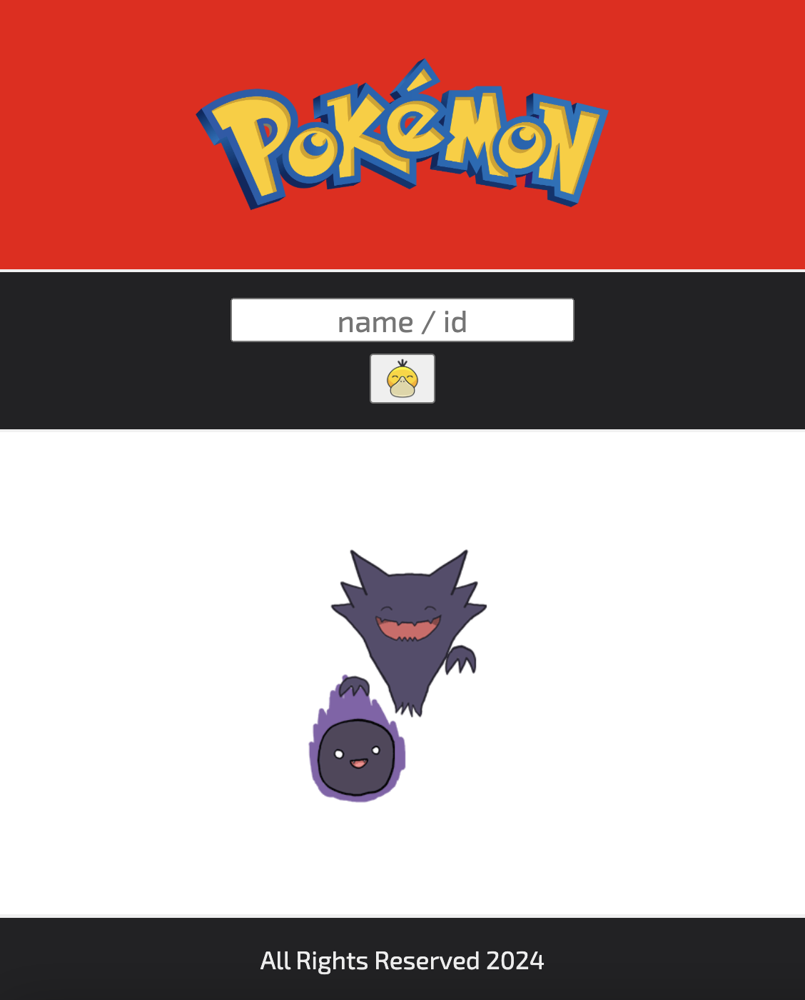
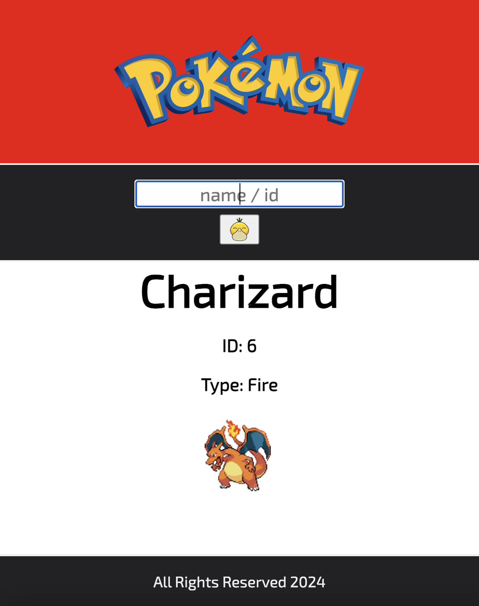

###### Accelerator Track Two

# React Assessment: Building a Simple Application

## Objective
The goal of this assessment is to test your React skills, including:
- Creating and managing **stateful components**.
- Passing state as **props** to child components.
- Building and handling a form as a **controlled component**.

## Instructions
1. **Fork & Clone this repository** to start working on your assessment.
2. This repo contains a React project using Vite.
    - after forking & cloning, `npm i`
    - then run `npm run dev` to open it in the browser
3. Complete the tasks below to build the required application.
4. Submit your completed app via `pull request` on the original repo and submit your repo URL to Google Classroom.
5. You will be using the PokeAPI, here is the base URL: `https://pokeapi.co/api/v2/pokemon`
- Example Pokemon Call URL: `https://pokeapi.co/api/v2/pokemon/ditto`

## Requirements

### 1. Stateful Component (App.jsx)
- Your **App** component should hold a string in state for the **pokemon we are searching for**  
- Initialize the state as an empty string. The setter function should be passed down to the SearchBar component. The state variable (getter) should be passed down to the DisplayPokemon component

### 2. Passing State as Props & Controlled Form (SearchBar.jsx)
- Create a **SearchBar** controlled component where a user can type in the name or ID number of the Pokemon to search for. 
- Manage the form's input using **controlled components** (state-driven input tags: "value" prop, "onChange" prop).
- Pass the setter function as a **prop** from the App component to the SearchBar component.
- The form should include:
  - A text input field.
  - A submit button.

### 3. Passing State as Props & Displaying Content (DisplayPokemon.jsx)
- Receive the **pokemon** state from App.jsx to display the Pokemon within the component.

### 4. Styling (Optional)
- Add some basic CSS to make the app visually appealing.
- Make the app responsive to function well despite the user's device.
- There are images in the `assets` folder to use within the app, as well as a favicon in `public` to use for the browser tab. Make use of them to make your app more appealing.

## Bonus (Optional)
- Use conditional rendering to display a loading indicator while fetching data.
- Validate the form to ensure the input is not empty before adding a new item.

## Example App Structure
- App.jsx
  - Header.jsx
  - SearchBar.jsx
  - DisplayPokemon.jsx
  - Footer.jsx

### Submission Instructions:
- Complete the requirements above.
- Push your completed work to your repository and submit the link on Google Classroom.
- Be prepared to explain how your code works during a follow-up discussion.

Good luck and happy coding! 🚀